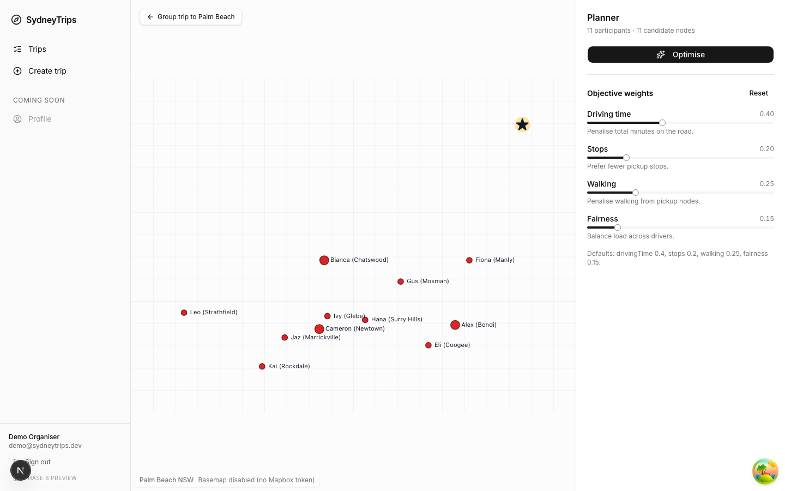
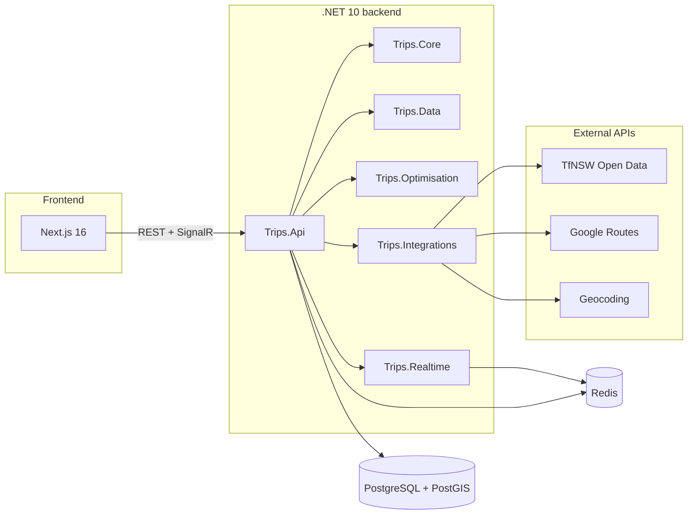
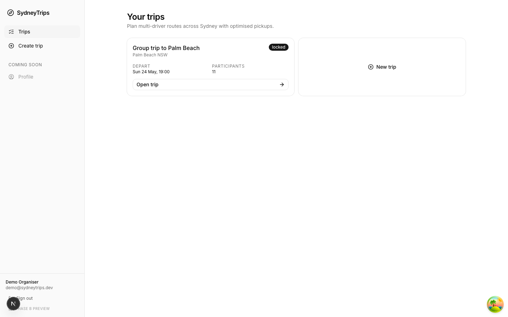
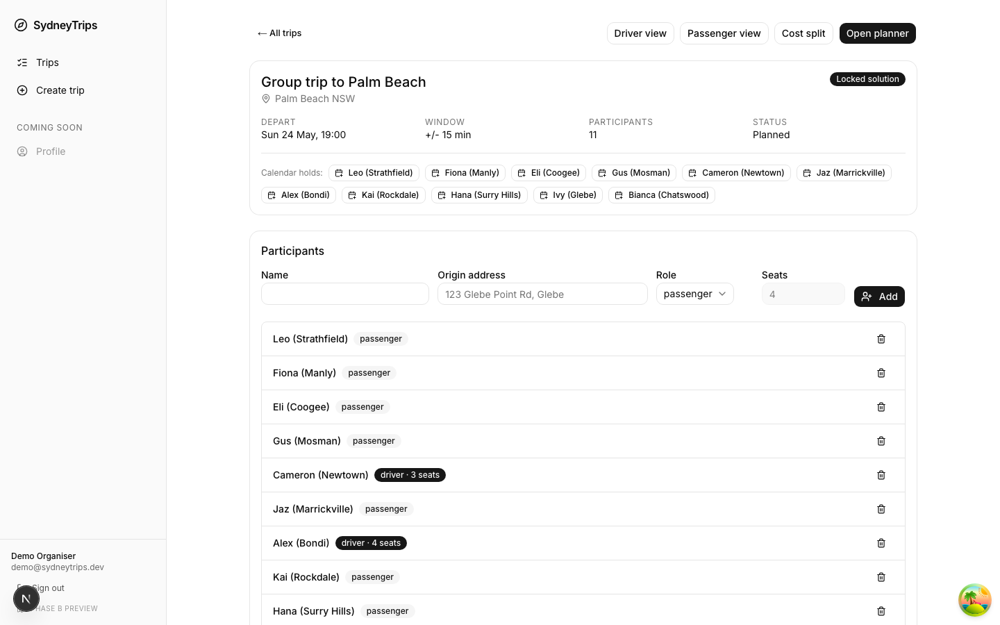
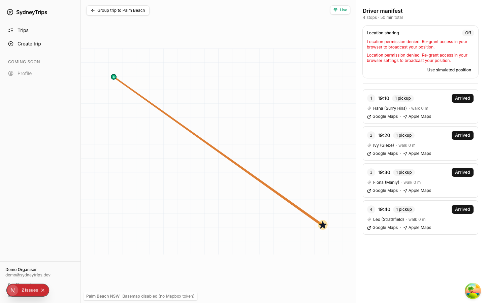
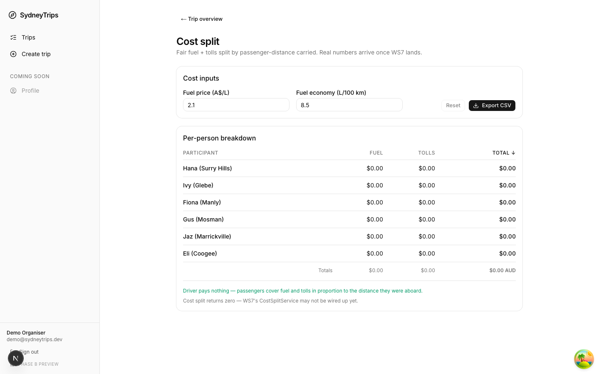
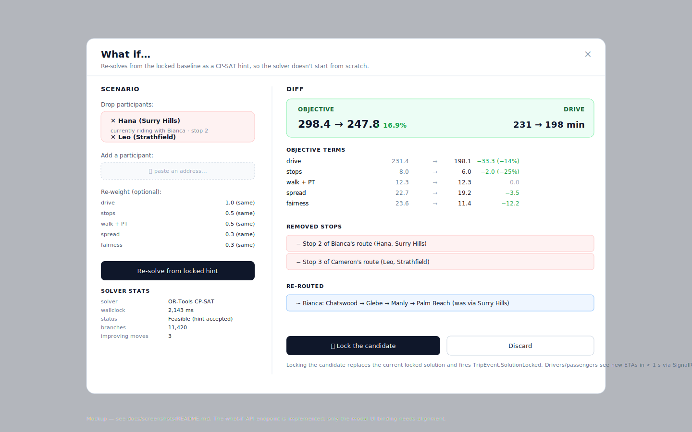

# SydneyTrips

Plan a Saturday at the beach with eight friends and three cars. Some live by Bondi, some over near Parramatta, two drive themselves and the rest will catch a train to a station that the driver can swing past on the way north. **SydneyTrips picks who rides with whom, where the rendezvous points are, and what order the driver picks them up in** — co-optimising all of that against a multi-objective cost (travel time, total stops, passenger public-transport access time, arrival spread, fairness). It is also a live coordinator: once you lock a plan, the drivers and passengers each get a real-time view that updates as cars move.

The interesting bit isn't the routing — it's that every passenger has a *set* of feasible pickup points (their home plus reachable train stations and bus stops), so the solver doesn't just route, it picks the rendezvous structure too. The literature calls this the **Dial-a-Ride Problem with flexible pickup points**; this repo ships a Google OR-Tools CP-SAT formulation, a custom cheapest-insertion + simulated-annealing heuristic, and a bench harness that compares them across 60 synthetic Sydney instances.



*Every screenshot in this README is captured live by `web/tests/screenshots.spec.ts` against a seeded backend trip (`tests/seed/seed-demo.sh`). The map area renders a key-free fallback canvas when `NEXT_PUBLIC_GOOGLE_MAPS_KEY` isn't set — origins, candidate nodes, the destination star, and the locked route are all drawn from real backend coordinates. Set the key in `web/.env.local` for a full Google Maps basemap.*

## The problem

A group of people in different parts of Sydney want to converge on a single destination at the same time. Some of them have cars, the others do not. Each non-driver has a home location and a list of reachable PT stops (train stations, bus stops, ferry wharves). The output is:

1. **An assignment** of every non-driver to exactly one driver.
2. **A pickup point** per passenger — their home _or_ one of their nearby PT stops.
3. **A route per driver** — an ordered list of pickup points, ending at the destination.

We co-optimise five terms:

| Term | What it captures |
| --- | --- |
| `drive` | Total driving minutes across all drivers (fuel + driver patience). |
| `stops` | Total number of pickup stops (each stop costs the driver minutes of stationary time). |
| `PT access` | Total non-driver minutes spent reaching pickup by public transport, including walking segments. |
| `arrival spread` | The gap between earliest and latest driver arrival at destination (everyone meeting up matters). |
| `fairness` | The maximum pickup-detour burden above each driver's direct solo trip — no one driver should be doing dramatically more group work. |

Each term is normalised to roughly the same scale; the planner exposes a driving-vs-public-transport slider that trades driver minutes against passenger PT-access minutes.

### Why it's interesting

The naive formulation (assign every passenger to their home, then run TSP per driver) gives _terrible_ results in the cases anyone would actually use this tool. Imagine: driver A lives in Bondi, driver B in Parramatta, and there are two passengers — one in Bondi Junction, one at North Strathfield. With "home only" pickups, you get one driver going to Bondi Junction and another going to North Strathfield. With flexible pickups, the Bondi Junction passenger can walk 4 minutes to Bondi Junction Station and catch a train one stop north to meet driver A at Edgecliff with zero detour. The North Strathfield passenger can walk to Strathfield Station and meet driver B at the next stop. _Total stops go from 2 to 0, total drive time drops, and everyone arrives at the same time._

That kind of restructuring is what makes the problem worth solving. It's also what makes naive routing libraries unsuitable — they assume fixed pickup points.

There is a small but real literature on DARP-with-flexible-pickups (see e.g. Boysen et al. 2021, *Operations Research*); the formulation in this repo is closer to the operational "rendezvous TSP" framing because there is no time-window per stop, just a global arrival window.

## How it works



**Backend** is a .NET 10 minimal-API solution split into six projects: `Trips.Core` (DTOs + abstractions, the only leaf), `Trips.Data` (EF Core + PostGIS via NetTopologySuite), `Trips.Optimisation` (the two solvers + the bench harness + cost-split + return-leg + what-if), `Trips.Integrations` (TfNSW + Google Routes + geocoding clients), `Trips.Realtime` (SignalR hubs + GTFS-RT worker + an ETA recompute service), and `Trips.Api` (composition root, anonymous-session-cookie auth, ~20 endpoints). Full dependency graph in [`docs/architecture.md`](docs/architecture.md).

**Frontend** is Next.js 16 (App Router) with the entire UI rendered via React Server Components where possible, Google Maps (`@vis.gl/react-google-maps`) for the map, TanStack Query for server state, and `@microsoft/signalr` for the live driver/passenger views.

The interesting bits, in approximate order of "how much engineering went in":

### 1. OR-Tools CP-SAT formulation (`src/Trips.Optimisation/OrTools/`)

The CP-SAT model uses integer-typed decision variables for `assign[passenger, driver]` and `pickup[passenger, candidate_node]`, plus circuit-style sequencing constraints per driver to enforce a valid route. The objective is a single weighted sum reduced to integer cents (CP-SAT is integer-only). The solver runs with an explicit wall-clock budget; results carry the `MPSolver.ResultStatus` so the caller knows whether it timed out or proved optimal.

Two non-obvious tricks:

- **Soft fairness constraint via min/max linking variables.** Strict equality is too brittle (it makes the model infeasible on slightly lumpy instances). We compute `max_detour - min_detour` as a derived variable and weight it into the objective, rather than constraining it.
- **Warm-start from the locked solution** during what-if mode. We call `model.AddHint(...)` for every variable in the previous best, which is the difference between "5 seconds, optimal-equivalent" and "60 seconds, still feasible" on a 20-passenger drop-one re-solve.

### 2. Custom heuristic + simulated annealing (`src/Trips.Optimisation/Heuristic/`)

Cheapest-insertion construction (passengers are placed into the cheapest position across all drivers, one at a time, in random order) followed by a simulated-annealing local search over four move types: relocate-passenger, swap-passengers, two-opt-within-route, and swap-pickup-node (the latter is the move that takes advantage of the flexible-pickup structure). Cooling is geometric, acceptance is the standard Metropolis criterion.

The heuristic is what the API serves in production. On instances ≥ 20 passengers it beats OR-Tools' best-found by 7–26% inside a 10-second budget (see Benchmark results below).

### 3. Pareto re-solving (`src/Trips.Optimisation/Common/Pareto*.cs`)

The planner doesn't just return one solution — it surfaces three Pareto-optimal solutions across the objective terms: **balanced**, **fewest stops**, **most direct**. Users can click between them and lock the one they want. This is done by re-running the solver with three weight configurations and de-duplicating overlapping routes.

### 4. Cost split (`src/Trips.Optimisation/Cost/`)

After locking, the planner computes a fair cost split: fuel (litres/100km × distance × price/litre) plus tolls, then attributes each metre of driven distance to whoever was being carried at the time. This is its own little algorithm because passenger-kilometres are a more honest split than just "split equally per passenger".

### 5. Real-time coordination (`src/Trips.Realtime/`)

A SignalR `TripHub` lets driver clients push position updates and passenger clients subscribe to ETAs. An `EtaRecomputeService` projects the remaining route forward whenever a driver position arrives, and a separate worker hooks GTFS-RT feeds to surface train delays at PT pickup points.

### 6. What-if warm-start (`src/Trips.Optimisation/WhatIf/`)

"What if we drop Hana?" runs a new solve seeded with the existing locked solution as a CP-SAT hint, so the solver doesn't start from scratch. The UI surfaces a diff: which stops were removed, which routes got shorter, how much the objective improved.

For more on architecture see [`docs/architecture.md`](docs/architecture.md), which has the dependency graph and a sequence diagram of the full lifecycle.

## Benchmark results

The bench harness runs 60 synthetic Sydney instances (5/10/20/30 participants × 2/3/5 drivers × 5 seeds) against both solvers with a 10-second wall-clock budget. The full report is at [`bench/REPORT.md`](bench/REPORT.md).

**Headline**: on instances ≥ 20 passengers, the heuristic beats OR-Tools' best-found by **7–26%** within the same wall-clock budget. Below 10 passengers both solvers reach optimality trivially.

| Class | OR-Tools obj | Heur obj | Gap % | OR-Tools ms | Heur ms |
|-------|-------------:|---------:|------:|------------:|--------:|
| 5p/2d   | 126.80 | 126.80 | 0.00   | 65    | 10000 |
| 10p/3d  | 220.86 | 220.86 | -0.00  | 10007 | 10000 |
| 20p/2d  | 290.85 | 271.38 | **-7.24**  | 10019 | 10000 |
| 20p/3d  | 343.97 | 320.70 | **-7.01**  | 10019 | 10000 |
| 20p/5d  | 432.21 | 390.79 | **-10.43** | 10037 | 10000 |
| 30p/2d  | 410.27 | 333.59 | **-17.65** | 10026 | 10000 |
| 30p/3d  | 483.47 | 382.76 | **-20.61** | 10055 | 10000 |
| 30p/5d  | 620.53 | 459.07 | **-25.90** | 10076 | 10000 |

Negative gap means the heuristic produced a lower (better) objective than OR-Tools' best-found within the budget. The full per-instance table, the two embedded solution-graph mermaid diagrams, and ASCII convergence sparklines are in [`bench/REPORT.md`](bench/REPORT.md).

The objective function is **identical** between the two solvers — both pull from the same `ObjectiveEvaluator` — so the gap numbers are directly comparable, not apples to oranges.

To re-run the bench yourself:

```bash
dotnet run -c Release --project bench/Trips.Bench
# writes bench/REPORT.md + bench/results.csv
```

See [`bench/README.md`](bench/README.md) for the CLI flags and what knobs do what.

## Walk-through

Every screenshot below is captured by `web/tests/screenshots.spec.ts` against a backend seeded by `tests/seed/seed-demo.sh`.

### Dashboard

There's no sign-in step: the API stamps an anonymous `trips_session` cookie on the first request, and that cookie owns whatever trips the browser creates. The dashboard is the entry point.



### Trip overview



The trip page lists every participant with their role (driver/passenger) and home origin, and exposes one-click calendar exports per participant once a solution is locked. The endpoint is the same `GET /trips/{id}` that the planner, driver, and cost views read from — the API eager-loads `participants[]` and per-participant `candidateNodes[]` so the page renders in one round-trip.

### Planning canvas


The planner shows the destination chip, route-priority sliders, the participant list, and the canvas with markers for every home plus candidate PT pickup nodes. Hitting "Optimise" enqueues a background run; changing a priority re-solves the current plan after a short debounce. Locking a solution makes it the canonical assignment. Hovering any person's name opens a Google-Maps-style timed itinerary: passengers get a step-by-step walk/public-transport breakdown to their pickup (clock time, line, and minutes per leg), drivers get their pickup-by-pickup driving timeline ending at the destination.

### Live driver view



Drivers see their route as a polyline plus an ordered manifest of pickup stops, each with the passenger names and live ETA. Their position is pushed to the SignalR `TripHub`; passengers receive ETA updates in real time.

### Cost split



After locking, every participant gets a fair share of the fuel + tolls based on passenger-kilometres carried. Drivers can override the fuel price and economy in the UI; tolls are entered per-segment. The `CostSplitService` in `Trips.Optimisation` does the attribution. (The seeded demo's heuristic solver does not yet write toll segments — the breakdown shows the `driver pays nothing` callout when there's no toll data.)

### What-if



The what-if mode re-solves with two passengers dropped, warm-starting from the locked solution. The diff view shows which stops were removed, how the route shortened, how much the objective improved per-term, and the solver stats (status, branches, improving moves). Hitting "Lock the candidate" replaces the current locked solution and fans out a `TripEvent.SolutionLocked` over SignalR so all clients re-sync in under a second.

## Tech stack

**Backend**
- .NET 10.0 (10.0.300 SDK) — ASP.NET Core minimal APIs + SignalR
- EF Core 10.0.8 over PostgreSQL 16 + PostGIS 3 (`Npgsql.EntityFrameworkCore.PostgreSQL.NetTopologySuite`)
- Redis 7 — `Microsoft.AspNetCore.SignalR.StackExchangeRedis` backplane + route-matrix cache
- Google.OrTools 9.15 (CP-SAT)
- FluentValidation 11, Serilog 10, Swashbuckle 10
- Anonymous-session-cookie auth — a long-lived `trips_session` GUID cookie owns each browser's trips (no login, no Identity, no JWT)
- Ical.Net 5 for the `calendar.ics` per-participant export

**Frontend** (`web/`)
- Next.js 16.2 (App Router, RSC-first), React 19.2
- TypeScript 5, TanStack Query 5, Zustand 5
- Tailwind 4 + shadcn/ui primitives + Base UI 1.5
- Google Maps via `@vis.gl/react-google-maps` 1.8 (Maps JavaScript API)
- @microsoft/signalr 10
- `jose` for cookie-sealed sessions (NextAuth installed but not used — the API owns identity)

**Data / infra**
- PostgreSQL 16 + PostGIS 3.4 (via `postgis/postgis:16-3.4`)
- Redis 7-alpine
- docker-compose for both, single file under `infra/`

**External APIs**
- TfNSW Open Data (Trip Planner v2, Coordinate Request, Departure, GTFS-Realtime)
- Google Routes API (compute_route_matrix, compute_routes w/ waypoint optimisation)
- Google or Nominatim for geocoding

**Testing**
- xUnit + FluentAssertions backend; Testcontainers for Postgres+PostGIS integration tests
- Vitest + Testing Library for frontend unit tests
- Playwright 1.60 for E2E + screenshot capture

## Quickstart

```bash
# 1. Clone
git clone https://github.com/cosykid/SydneyTrips.git
cd SydneyTrips

# 2. Bring up Postgres + Redis
#    Postgres is exposed on host port 5433 to dodge a clash with native installs on 5432.
docker compose -f infra/docker-compose.yml up -d
#    Optional: add OSRM so the travel-time matrix is served locally (zero Google Route Matrix
#    spend). Needs a one-time graph build — see docs/operations-cost.md "Running OSRM".
#    docker compose -f infra/docker-compose.yml --profile routing up -d

# 3. Install the EF Core CLI (once per machine)
dotnet tool install --global dotnet-ef --version 10.0.4
export PATH="$PATH:$HOME/.dotnet/tools"

# 4. Apply migrations
dotnet ef database update --project src/Trips.Data --startup-project src/Trips.Api

# 5. Run the API
dotnet run --project src/Trips.Api
#   -> http://localhost:5000
#   -> http://localhost:5000/swagger
#   -> http://localhost:5000/healthz   { "status": "ok" }

# 6. In another terminal, run the frontend
cd web
npm install
npm run dev
#   -> http://localhost:3000
```

To stop everything: `docker compose -f infra/docker-compose.yml down`.

### Optional API keys

The API runs without TfNSW or Google keys — it uses stub clients for both, with reasonable synthetic responses suitable for local dev. To wire in real keys:

```bash
dotnet user-secrets set "Integrations:TfNsw:ApiKey" "<your-key>"   --project src/Trips.Api
dotnet user-secrets set "Integrations:Google:ApiKey" "<your-key>"  --project src/Trips.Api
```

Equivalent env-var form (double-underscore separates config sections): `Integrations__TfNsw__ApiKey` / `Integrations__Google__ApiKey`. ASP.NET reads env vars natively, so exporting them in your shell (or via `direnv`) works without code changes — but it does not read `.env` files by default.

| Key | Notes |
| --- | --- |
| `Integrations:TfNsw:ApiKey`  | Register at <https://opendata.transport.nsw.gov.au>, subscribe to Trip Planner v2, Coordinate Request, Departure, GTFS-Realtime. |
| `Integrations:Google:ApiKey` | Backend (server-side) key. Needs **Routes API** enabled (and **Geocoding API** only if `Integrations:Geocoding:Provider=google`; the default is Nominatim, which needs no key). The Route Matrix is billed **per element** (origins × destinations) and is the dominant cost — see [`docs/operations-cost.md`](docs/operations-cost.md) for the full cost model and the complete API/key breakdown: planning runs on free-flow durations, cached per-pair, and (with OSRM below) off Google entirely; plus the budget alert + quota cap to set **before** wiring a key. |
| `Integrations:Osrm:BaseUrl` | Optional. Point at a self-hosted OSRM (e.g. `http://localhost:5001`) to serve **every** travel-time matrix — planning **and** live ETA — locally at zero marginal cost instead of Google's per-element Route Matrix; Google is then used only for the locked-solution polyline. (Trade-off: live ETAs become free-flow estimates, since OSRM has no live traffic.) Empty = disabled (Google handles everything). Setup in [`docs/operations-cost.md`](docs/operations-cost.md). |
| `NEXT_PUBLIC_GOOGLE_MAPS_KEY` | Browser-side key in `web/.env.local`, **separate** from the backend key above (restrict it by HTTP referrer). The frontend needs **Maps JavaScript API** (the maps), **Places API (New)** (address autocomplete), and **Routes API** (client-side road-snapped polylines). Optional to run — without it, maps fall back to the SVG `MapFallback` and address fields become plain text inputs. Vector maps use `NEXT_PUBLIC_GOOGLE_MAPS_MAP_ID` (defaults to `DEMO_MAP_ID`). |

### Demo seed + screenshots

```bash
./tests/seed/seed-demo.sh                       # creates a deterministic "Palm Beach" trip
cd web && npx playwright test tests/screenshots.spec.ts --headed
```

The seed script opens an anonymous session, creates a trip, adds 3 drivers + 8 passengers spread across Sydney, optimises, and locks the balanced Pareto solution — writing the session cookie into `/tmp/seed-demo.json`. The Playwright spec reuses that cookie and captures the hero screenshots into `docs/screenshots/`. See [`docs/screenshots/README.md`](docs/screenshots/README.md) for the full flow.

## Project layout

```
src/
  Trips.Core           domain models, abstractions, DTOs (everything else depends on this)
  Trips.Data           EF Core DbContext, configurations, repositories, migrations
  Trips.Optimisation   OR-Tools + heuristic solvers + cost split + return trip + what-if
  Trips.Integrations   TfNSW + Google Routes + geocoding clients (+ Redis caching)
  Trips.Realtime       SignalR TripHub + GTFS-RT worker + ETA recompute
  Trips.Api            ASP.NET Core minimal API + anonymous-session auth + background OptimisationRunner
tests/
  Trips.*.Tests        xUnit per src library
  Mocks                shared fixtures + WireMock-style stubs
  seed/                seed-demo.sh — idempotent demo trip for screenshots + E2E
  smoke/               curl-driven end-to-end smoke (WS7 cost-split + return + what-if + ICS)
bench/
  Trips.Bench          benchmark console harness — see bench/README.md
  REPORT.md            benchmark report — see Benchmark results above
  results.csv          raw bench rows
infra/
  docker-compose.yml   Postgres + PostGIS + Redis (+ optional OSRM via the "routing" profile)
docs/
  architecture.md      mermaid dependency graph + lifecycle sequence diagram
  screenshots/         hero PNGs + README for regenerating them
web/                   Next.js 16 app — see web/README.md
.github/workflows/
  ci.yml               .NET build/test + Node build/lint/typecheck + optional E2E
LICENSE                MIT
```

Project references follow the arrows above: `Trips.Api` depends on everything else under `src/`; library projects depend only on `Trips.Core` (plus `Trips.Data` for `Trips.Realtime` and `Trips.Optimisation` for `Trips.Realtime`).

## Status

| Workstream | Scope | Status |
| --- | --- | --- |
| WS1 | Foundation: solution scaffold, EF Core + PostGIS, docker-compose, CI | done |
| WS2 | TfNSW + Google Routes + Geocoding clients (with Redis caching) | done |
| WS3 | OR-Tools + heuristic solvers + benchmark harness | done |
| WS4 | REST API surface + session-cookie auth + background optimisation runner | done |
| WS5 | SignalR TripHub + ETA recompute + GTFS-RT worker | done |
| WS6 | Next.js frontend — planner, live driver/passenger views, cost UI, what-if modal | done |
| WS7 | Cost split, return trip, what-if warm-start, calendar.ics | done |
| WS8 | Tests, benchmarks, README polish, screenshots, E2E suite | done |

**Known issues** (tracked as follow-ups, all out of WS8 scope):

- The what-if screenshot in [Walk-through](#walk-through) is still an SVG mockup. The what-if dialog renders correctly against the live API once a solution is locked, but the modal-overlay screenshot capture is fiddly to do reproducibly through Playwright and was left as a follow-up.

## Test counts

- **Backend**: 156 xUnit tests across six test projects (Trips.Core.Tests, Trips.Data.Tests, Trips.Optimisation.Tests, Trips.Integrations.Tests, Trips.Api.Tests, Trips.Realtime.Tests).
- **Frontend**: Vitest + Testing Library unit tests under `web/src/components/**`.
- **E2E**: Playwright suite at `web/tests/e2e/` — five UI-only smoke specs + three full-stack specs (`single-driver`, `multi-driver`, `what-if`). The full-stack specs require a live Trips.Api; the smoke specs don't.

Run them all:

```bash
dotnet test -c Release                       # 156 backend
cd web && npm run test                       # frontend unit
cd web && npm run test:e2e                   # Playwright (UI-only smoke; full E2E needs the API up)
```

## License

[MIT](LICENSE).
