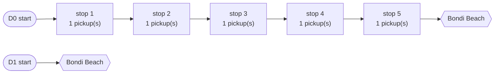
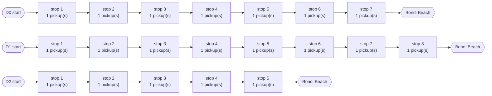

# Sydney Group-Trip Optimisation — Benchmark Report

_Generated 2026-05-23 07:46:20Z from 60 instances._

## Headline

- **Average gap (heuristic vs OR-Tools)**: -7.42%
- **Median runtime (OR-Tools)**: 10022 ms
- **Median runtime (Heuristic)**: 10000 ms
- **Total instances**: 60 across 12 classes

## How to read this

Each row in the **Summary table** averages over multiple seeds for one instance class (e.g. "10p/3d" = 10 passengers, 3 drivers).

- **OR-Tools obj** is the best objective found by the CP-SAT model within the wall-clock budget. If OR-Tools terminates with `Optimal` status it is *the* optimum; otherwise it's just a feasible upper bound.
- **Heuristic obj** is the best objective from cheapest-insertion construction + simulated-annealing local search.
- **Gap %** is `(heur − ortools) / ortools × 100`. Negative means the heuristic beat OR-Tools' best-found (only possible when OR-Tools timed out before reaching optimal).
- **Obj** is a weighted sum of five terms — drive, stops, PT-access time, arrival-spread, fairness — using `ObjectiveWeights.Balanced`. The two solvers use the *exact same* `ObjectiveEvaluator` so the values are directly comparable.

Travel times are synthetic: haversine × 1.25 congestion multiplier. The bench does not call the real Google Routes API — see `InstanceGenerator.cs` for the model.

## Summary table (per instance class)

| Class | n | OR-Tools obj | Heur obj | Gap % | OR-Tools ms | Heur ms | OR-Tools stops | Heur stops |
|-------|---|-------------:|---------:|------:|------------:|--------:|---------------:|-----------:|
| 5p/2d | 5 | 126.80 | 126.80 | 0.00 | 65 | 10000 | 5.0 | 5.0 |
| 5p/3d | 5 | 131.81 | 131.81 | 0.00 | 184 | 10000 | 5.0 | 5.0 |
| 5p/5d | 5 | 169.07 | 169.07 | 0.00 | 742 | 10000 | 5.0 | 5.0 |
| 10p/2d | 5 | 213.61 | 213.17 | -0.23 | 10021 | 10000 | 10.0 | 10.0 |
| 10p/3d | 5 | 220.86 | 220.86 | -0.00 | 10007 | 10000 | 10.0 | 10.0 |
| 10p/5d | 5 | 298.90 | 298.82 | 0.05 | 10030 | 10000 | 10.0 | 10.0 |
| 20p/2d | 5 | 290.85 | 271.38 | -7.24 | 10019 | 10000 | 20.0 | 20.0 |
| 20p/3d | 5 | 343.97 | 320.70 | -7.01 | 10019 | 10000 | 20.0 | 20.0 |
| 20p/5d | 5 | 432.21 | 390.79 | -10.43 | 10037 | 10000 | 20.0 | 20.0 |
| 30p/2d | 5 | 410.27 | 333.59 | -17.65 | 10026 | 10000 | 30.0 | 30.0 |
| 30p/3d | 5 | 483.47 | 382.76 | -20.61 | 10055 | 10000 | 30.0 | 30.0 |
| 30p/5d | 5 | 620.53 | 459.07 | -25.90 | 10076 | 10000 | 30.0 | 30.0 |

## Detailed results (one row per instance)

| Class | Seed | Destination | OR-Tools obj | OR status | OR ms | Heur obj | Heur ms | Heur iters | Gap % |
|-------|------|-------------|-------------:|-----------|------:|---------:|--------:|-----------:|------:|
| 5p/2d | 11 | Bondi Beach | 77.60 | Optimal | 209 | 77.60 | 10002 | 41,645,554 | 0.00 |
| 5p/2d | 23 | Wattamolla (Royal NP) | 108.81 | Optimal | 65 | 108.81 | 10000 | 35,096,581 | 0.00 |
| 5p/2d | 37 | Palm Beach | 143.54 | Optimal | 50 | 143.54 | 10000 | 34,887,225 | 0.00 |
| 5p/2d | 41 | Palm Beach | 158.56 | Optimal | 52 | 158.56 | 10000 | 39,861,868 | 0.00 |
| 5p/2d | 53 | Bondi Beach | 145.48 | Optimal | 310 | 145.48 | 10000 | 33,448,563 | 0.00 |
| 5p/3d | 11 | Bondi Beach | 115.27 | Optimal | 223 | 115.27 | 10000 | 36,782,272 | 0.00 |
| 5p/3d | 23 | Wattamolla (Royal NP) | 134.11 | Optimal | 35 | 134.11 | 10000 | 37,827,760 | 0.00 |
| 5p/3d | 37 | Palm Beach | 162.56 | Optimal | 61 | 162.56 | 10000 | 36,097,339 | 0.00 |
| 5p/3d | 41 | Palm Beach | 137.10 | Optimal | 184 | 137.10 | 10000 | 34,943,618 | 0.00 |
| 5p/3d | 53 | Bondi Beach | 110.03 | Optimal | 720 | 110.03 | 10000 | 29,808,191 | 0.00 |
| 5p/5d | 11 | Bondi Beach | 151.94 | Optimal | 3172 | 151.94 | 10000 | 24,413,963 | 0.00 |
| 5p/5d | 23 | Wattamolla (Royal NP) | 189.64 | Optimal | 287 | 189.64 | 10000 | 30,487,912 | 0.00 |
| 5p/5d | 37 | Palm Beach | 178.79 | Optimal | 742 | 178.79 | 10000 | 23,219,981 | 0.00 |
| 5p/5d | 41 | Palm Beach | 181.01 | Optimal | 457 | 181.01 | 10000 | 26,390,364 | 0.00 |
| 5p/5d | 53 | Bondi Beach | 143.98 | Optimal | 847 | 143.98 | 10000 | 26,556,030 | 0.00 |
| 10p/2d | 11 | Bondi Beach | 251.71 | Feasible | 10022 | 251.71 | 10001 | 21,896,037 | 0.00 |
| 10p/2d | 23 | Wattamolla (Royal NP) | 190.51 | Feasible | 10032 | 188.31 | 10000 | 24,083,640 | -1.16 |
| 10p/2d | 37 | Palm Beach | 161.05 | Optimal | 2102 | 161.05 | 10000 | 25,480,763 | -0.00 |
| 10p/2d | 41 | Palm Beach | 319.29 | Feasible | 10009 | 319.29 | 10000 | 25,015,866 | -0.00 |
| 10p/2d | 53 | Bondi Beach | 145.49 | Feasible | 10021 | 145.49 | 10000 | 27,893,360 | 0.00 |
| 10p/3d | 11 | Bondi Beach | 254.51 | Feasible | 10007 | 254.51 | 10000 | 26,077,051 | -0.00 |
| 10p/3d | 23 | Wattamolla (Royal NP) | 183.28 | Feasible | 10013 | 183.28 | 10000 | 25,635,741 | 0.00 |
| 10p/3d | 37 | Palm Beach | 220.93 | Optimal | 4217 | 220.93 | 10000 | 24,683,861 | 0.00 |
| 10p/3d | 41 | Palm Beach | 309.07 | Feasible | 10092 | 309.07 | 10000 | 27,836,344 | -0.00 |
| 10p/3d | 53 | Bondi Beach | 136.51 | Optimal | 4115 | 136.51 | 10000 | 25,495,148 | 0.00 |
| 10p/5d | 11 | Bondi Beach | 362.21 | Feasible | 10051 | 362.21 | 10000 | 25,780,559 | 0.00 |
| 10p/5d | 23 | Wattamolla (Royal NP) | 298.05 | Feasible | 10037 | 298.05 | 10000 | 23,777,334 | -0.00 |
| 10p/5d | 37 | Palm Beach | 262.38 | Feasible | 10011 | 265.23 | 10000 | 23,868,231 | 1.09 |
| 10p/5d | 41 | Palm Beach | 393.23 | Feasible | 10016 | 389.99 | 10000 | 23,998,157 | -0.82 |
| 10p/5d | 53 | Bondi Beach | 178.62 | Feasible | 10030 | 178.62 | 10000 | 24,809,211 | 0.00 |
| 20p/2d | 11 | Bondi Beach | 288.87 | Feasible | 10014 | 285.53 | 10000 | 20,084,347 | -1.16 |
| 20p/2d | 23 | Wattamolla (Royal NP) | 223.70 | Feasible | 10014 | 223.70 | 10000 | 19,330,353 | 0.00 |
| 20p/2d | 37 | Palm Beach | 358.97 | Feasible | 10019 | 328.89 | 10000 | 19,439,571 | -8.38 |
| 20p/2d | 41 | Palm Beach | 338.25 | Feasible | 10027 | 342.64 | 10000 | 19,874,411 | 1.30 |
| 20p/2d | 53 | Bondi Beach | 244.47 | Feasible | 10037 | 176.16 | 10000 | 17,744,438 | -27.94 |
| 20p/3d | 11 | Bondi Beach | 385.06 | Feasible | 10017 | 341.11 | 10000 | 17,523,596 | -11.41 |
| 20p/3d | 23 | Wattamolla (Royal NP) | 321.62 | Feasible | 10019 | 289.18 | 10000 | 18,054,029 | -10.09 |
| 20p/3d | 37 | Palm Beach | 370.70 | Feasible | 10137 | 362.22 | 10000 | 18,320,945 | -2.29 |
| 20p/3d | 41 | Palm Beach | 424.25 | Feasible | 10018 | 410.09 | 10000 | 18,038,015 | -3.34 |
| 20p/3d | 53 | Bondi Beach | 218.20 | Feasible | 10031 | 200.91 | 10000 | 18,139,268 | -7.93 |
| 20p/5d | 11 | Bondi Beach | 460.30 | Feasible | 10028 | 422.79 | 10000 | 17,521,115 | -8.15 |
| 20p/5d | 23 | Wattamolla (Royal NP) | 465.76 | Feasible | 10037 | 398.31 | 10000 | 17,078,718 | -14.48 |
| 20p/5d | 37 | Palm Beach | 469.41 | Feasible | 10031 | 459.17 | 10000 | 16,721,703 | -2.18 |
| 20p/5d | 41 | Palm Beach | 476.66 | Feasible | 10037 | 443.92 | 10000 | 17,598,638 | -6.87 |
| 20p/5d | 53 | Bondi Beach | 288.92 | Feasible | 10071 | 229.74 | 10000 | 16,780,176 | -20.48 |
| 30p/2d | 11 | Bondi Beach | 366.38 | Feasible | 10051 | 323.33 | 10000 | 15,957,740 | -11.75 |
| 30p/2d | 23 | Wattamolla (Royal NP) | 391.03 | Feasible | 10026 | 343.09 | 10000 | 16,258,071 | -12.26 |
| 30p/2d | 37 | Palm Beach | 411.97 | Feasible | 10024 | 367.54 | 10000 | 15,643,901 | -10.78 |
| 30p/2d | 41 | Palm Beach | 499.78 | Feasible | 10026 | 314.14 | 10004 | 14,912,771 | -37.14 |
| 30p/2d | 53 | Bondi Beach | 382.22 | Feasible | 10194 | 319.86 | 10000 | 15,674,808 | -16.32 |
| 30p/3d | 11 | Bondi Beach | 451.10 | Feasible | 10174 | 368.27 | 10000 | 14,704,094 | -18.36 |
| 30p/3d | 23 | Wattamolla (Royal NP) | 478.80 | Feasible | 10053 | 413.24 | 10000 | 15,239,575 | -13.69 |
| 30p/3d | 37 | Palm Beach | 567.12 | Feasible | 10055 | 404.18 | 10000 | 14,861,670 | -28.73 |
| 30p/3d | 41 | Palm Beach | 495.13 | Feasible | 10074 | 406.17 | 10000 | 14,388,132 | -17.97 |
| 30p/3d | 53 | Bondi Beach | 425.24 | Feasible | 10047 | 321.93 | 10000 | 14,565,043 | -24.30 |
| 30p/5d | 11 | Bondi Beach | 586.97 | Feasible | 10076 | 454.65 | 10000 | 11,584,601 | -22.54 |
| 30p/5d | 23 | Wattamolla (Royal NP) | 637.67 | Feasible | 10067 | 450.00 | 10000 | 15,130,169 | -29.43 |
| 30p/5d | 37 | Palm Beach | 685.34 | Feasible | 10066 | 483.26 | 10000 | 13,890,754 | -29.49 |
| 30p/5d | 41 | Palm Beach | 648.68 | Feasible | 10078 | 500.69 | 10000 | 14,831,166 | -22.81 |
| 30p/5d | 53 | Bondi Beach | 543.98 | Feasible | 10089 | 406.76 | 10000 | 13,092,344 | -25.22 |

## Hand-picked example solutions

### Small instance: 5p/2d seed=11 → Bondi Beach

**OR-Tools** objective=77.60 terms=[drive=75.60, stops=2.00, pt_access=0.00, spread=0.00, fair=0.00] ms=209


**Heuristic** objective=77.60 terms=[drive=75.60, stops=2.00, pt_access=0.00, spread=0.00, fair=0.00] ms=10002 iters=41,645,554



### Larger instance: 20p/3d seed=11 → Bondi Beach

**OR-Tools** objective=385.06 terms=[drive=323.45, stops=8.00, pt_access=0.00, spread=26.80, fair=26.80] ms=10017



**Heuristic** objective=341.11 terms=[drive=273.56, stops=8.00, pt_access=0.00, spread=29.78, fair=29.78] ms=10000 iters=17,523,596

```mermaid
graph LR
  heur_d0_origin(["D0 start"])
  heur_d0_origin(["D0 start"]) --> heur_d0_s0["stop 1<br/>1 pickup(s)"]
  heur_d0_s0["stop 1<br/>1 pickup(s)"] --> heur_d0_s1["stop 2<br/>1 pickup(s)"]
  heur_d0_s1["stop 2<br/>1 pickup(s)"] --> heur_d0_s2["stop 3<br/>1 pickup(s)"]
  heur_d0_s2["stop 3<br/>1 pickup(s)"] --> heur_d0_s3["stop 4<br/>1 pickup(s)"]
  heur_d0_s3["stop 4<br/>1 pickup(s)"] --> heur_d0_s4["stop 5<br/>1 pickup(s)"]
  heur_d0_s4["stop 5<br/>1 pickup(s)"] --> heur_d0_s5["stop 6<br/>1 pickup(s)"]
  heur_d0_s5["stop 6<br/>1 pickup(s)"] --> heur_d0_dest{{"Bondi Beach"}}
  heur_d1_origin(["D1 start"])
  heur_d1_origin(["D1 start"]) --> heur_d1_s0["stop 1<br/>1 pickup(s)"]
  heur_d1_s0["stop 1<br/>1 pickup(s)"] --> heur_d1_s1["stop 2<br/>1 pickup(s)"]
  heur_d1_s1["stop 2<br/>1 pickup(s)"] --> heur_d1_s2["stop 3<br/>1 pickup(s)"]
  heur_d1_s2["stop 3<br/>1 pickup(s)"] --> heur_d1_s3["stop 4<br/>1 pickup(s)"]
  heur_d1_s3["stop 4<br/>1 pickup(s)"] --> heur_d1_s4["stop 5<br/>1 pickup(s)"]
  heur_d1_s4["stop 5<br/>1 pickup(s)"] --> heur_d1_s5["stop 6<br/>1 pickup(s)"]
  heur_d1_s5["stop 6<br/>1 pickup(s)"] --> heur_d1_s6["stop 7<br/>1 pickup(s)"]
  heur_d1_s6["stop 7<br/>1 pickup(s)"] --> heur_d1_s7["stop 8<br/>1 pickup(s)"]
  heur_d1_s7["stop 8<br/>1 pickup(s)"] --> heur_d1_s8["stop 9<br/>1 pickup(s)"]
  heur_d1_s8["stop 9<br/>1 pickup(s)"] --> heur_d1_dest{{"Bondi Beach"}}
  heur_d2_origin(["D2 start"])
  heur_d2_origin(["D2 start"]) --> heur_d2_s0["stop 1<br/>1 pickup(s)"]
  heur_d2_s0["stop 1<br/>1 pickup(s)"] --> heur_d2_s1["stop 2<br/>1 pickup(s)"]
  heur_d2_s1["stop 2<br/>1 pickup(s)"] --> heur_d2_s2["stop 3<br/>1 pickup(s)"]
  heur_d2_s2["stop 3<br/>1 pickup(s)"] --> heur_d2_s3["stop 4<br/>1 pickup(s)"]
  heur_d2_s3["stop 4<br/>1 pickup(s)"] --> heur_d2_s4["stop 5<br/>1 pickup(s)"]
  heur_d2_s4["stop 5<br/>1 pickup(s)"] --> heur_d2_dest{{"Bondi Beach"}}

```



## Heuristic convergence (ASCII sparkline)

Best objective so far, sampled over the iteration history. The curve is the running minimum. A flat line means SA accepted no improving moves; a step-down marks a basin escape.

**Small instance: 5p/2d seed=11**

```
max obj 112.02  →  min obj 77.60  (4 improving steps, last at iter 473)
***************                                                                 
                                                                                
                                                                                
                                                                                
                                                                                
                                                                                
                                                                                
                                                                                
                                                                                
                                                                                
                                                                                
               *****************************************************************
iter        0                              …                                   473

```

**Larger instance: 20p/3d seed=11**

```
max obj 394.41  →  min obj 341.11  (23 improving steps, last at iter 7,508)
************************                                                        
                                                                                
                                                                                
                        **************                                          
                                                                                
                                      **                                        
                                        **                                      
                                                                                
                                                                                
                                          *******                               
                                                 *******************************
                                                                                
iter        0                              …                                 7,508

```

## Raw data

All per-instance numbers are in [`results.csv`](results.csv). Columns include per-term objective values, OR-Tools status/gap/branches, heuristic iteration count and acceptance rate, and stop counts.
