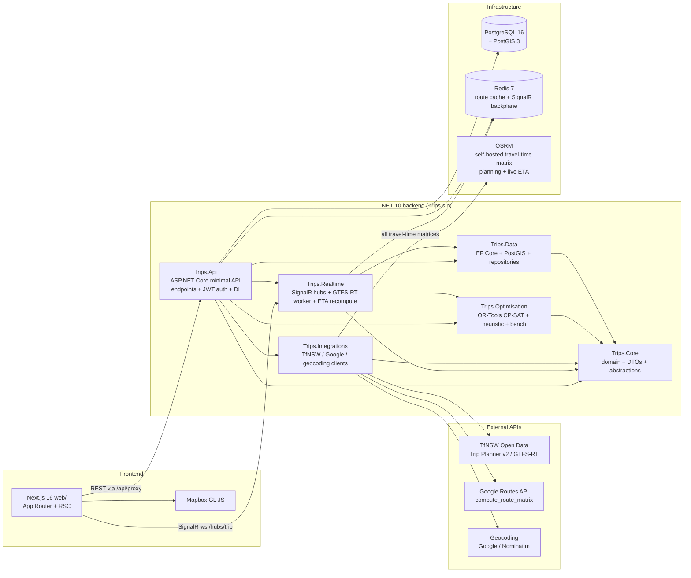

# Architecture

This file is the cross-section view: how the six .NET projects fit together, where the external integrations sit, and how a single optimisation lifecycle flows from "user adds a participant" to "driver sees a manifest in their browser."

It is the companion to the top-level `README.md`. The README answers _what_ this project is and _why_ the problem is interesting; this file answers _how_ the pieces talk.

## Backend dependency graph

`src/Trips.Core` is the leaf — no project depends on anything else. Every other library targets `Trips.Core` so they can speak in the same DTOs and domain types. `Trips.Api` is the only project that pulls in all of the others; it is the composition root.



Two things worth calling out:

- **`Trips.Realtime` depends on `Trips.Optimisation`.** That is intentional — when a driver position update arrives the ETA recomputer needs solver primitives (travel-time matrices, the assignment shape) to project the rest of the route forward. Keeping the dependency here keeps the API project from becoming a bag of glue code.
- **`Trips.Integrations` does not depend on `Trips.Data`.** External clients are pure functions over domain DTOs; caching is via Redis and is wired in `Program.cs` rather than baked into the integrations layer. That makes them trivial to swap or mock in tests.

## Frontend → API path

Browsers never see the JWT directly. Every authenticated REST call hits `/api/proxy/*` (a route handler in `web/src/app/api/proxy/[...path]/route.ts`) which reads the httpOnly session cookie server-side and forwards the bearer token to `Trips.Api`.

SignalR is the exception. The browser asks `/api/realtime/token` for a short-lived JWT, then dials `Trips.Realtime`'s hub at `ws://api/hubs/trip` directly over WebSockets. SignalR can't set `Authorization` on the upgrade handshake, so the token rides as `?access_token=...` — `Program.cs` pulls it through on `OnMessageReceived` when the path starts with `/hubs`.

## Lifecycle: "create a trip → see the driver moving"

```mermaid
sequenceDiagram
    autonumber
    participant U as User (browser)
    participant N as Next.js /api/proxy
    participant API as Trips.Api
    participant DB as PostgreSQL+PostGIS
    participant OPT as Trips.Optimisation
    participant RT as Trips.Realtime (SignalR hub)
    participant GR as Google Routes

    U->>N: POST /trips  (name, destination, depart_at)
    N->>API: forward with bearer JWT
    API->>DB: INSERT trip + TripCreated event
    API-->>U: 201 + trip DTO

    loop one per participant
        U->>API: POST /trips/{id}/participants
        API->>DB: insert participant + candidate nodes
    end

    U->>API: POST /trips/{id}/optimise (weights, solver)
    API->>OPT: enqueue OptimisationRun
    OPT->>GR: compute_route_matrix (or cached)
    OPT->>OPT: CP-SAT search + SA refine
    OPT-->>DB: write run, pareto solutions
    API-->>U: 202 { runId }

    U->>API: GET /trips/{id}/runs/{runId}
    API-->>U: status = Completed, pareto

    U->>API: POST /trips/{id}/lock-solution
    API->>DB: write locked solution, fan-out events

    Note over U,RT: Driver/passenger views open
    U->>RT: WebSocket /hubs/trip + JWT
    RT-->>U: ack subscription

    loop driver position
        U->>RT: DriverPositionUpdate (lat, lng, heading)
        RT->>OPT: recompute remaining ETAs
        RT-->>U: PassengerEtaUpdate to all riders
        RT->>DB: append TripEvent (DriverDeparted / Arrived)
    end

    U->>API: POST /trips/{id}/whatif (drop participant)
    API->>OPT: solve from locked hint (warm-start)
    OPT-->>API: pareto diff
    API-->>U: diff payload
```

## Why this shape

A few design calls that the diagram does not show:

- **Optimisation runs are out-of-band.** The HTTP request returns a `runId` immediately; a background `OptimisationRunner` does the actual solve. The frontend polls `GET /runs/{runId}` for completion and pulls the Pareto set when ready. This keeps API response times bounded regardless of instance size.
- **Cost split + return-trip + what-if all live in `Trips.Optimisation`.** They reuse the same `ObjectiveEvaluator` as the main solver so the numbers are directly comparable. What-if uses CP-SAT `AddHint` warm-starting from the locked solution.
- **SignalR over Redis backplane.** The hub backplane means we can run multiple `Trips.Api` replicas behind a load balancer and a passenger connection landing on replica B will still receive driver-position updates that arrived at replica A.
- **Google Route Matrix cost is engineered down, not just alerted on.** The matrix is billed per element (origins × destinations) and is the project's dominant external cost. The layering, from cheapest to fallback: (1) **OSRM serves every travel-time matrix.** When `Integrations:Osrm:BaseUrl` is set, `HybridRoutesClient` routes both the planning matrix **and** the live-ETA matrix to a self-hosted OSRM `/table` — the whole grid in one local call at zero marginal cost — so Google's per-element Route Matrix is **never called**; Google keeps only the locked-solution polyline (`ComputeRoutes`). The trade is that live ETAs become free-flow estimates (OSRM has no live traffic) — a deliberate choice to take the dominant cost to zero. (2) The planner requests **free-flow** durations (`trafficAware: false`) regardless of provider — it solves against a *future* departure, so a live-traffic snapshot at plan time is noise (and on a Google-only deployment, free-flow is the cheaper "Essentials" SKU). (3) `CachingGoogleRoutesClient` caches **per origin→destination pair** (coordinates snapped to ~11 m), so shared legs and incremental re-plans only ever bill genuinely new pairs. The cache reads `Integrations:Cache:RedisConnectionString` and now falls back to `ConnectionStrings:Redis` — without that fallback it had silently been a no-op (every run paid full freight). Operational guardrails (budget alert + a hard quota cap) live in [`operations-cost.md`](operations-cost.md).

For the deeper "why these terms in the objective" story see [`bench/REPORT.md`](../bench/REPORT.md) and the README's _The problem_ section.
